# Visual ER Diagram - Event-Driven E-Commerce System

## Database Schema Diagram

## Service Architecture Diagram

## Event Flow Diagram (Saga Pattern)

## Saga Compensation Flow

## Kafka Topics & Event Types

## Database Collections Per Service

```mermaid
graph TD
    subgraph OrderServiceDB["🗄️ order_service DB"]
        OS1["orders<br/>(Command State)"]
        OS2["processed_events<br/>(Idempotency)"]
        OS3["outbox<br/>(Transactional)"]
    end
    
    subgraph InventoryServiceDB["🗄️ inventory_service DB"]
        IS1["processed_events"]
        IS2["outbox"]
    end
    
    subgraph PaymentServiceDB["🗄️ payment_service DB"]
        PS1["processed_events"]
        PS2["outbox"]
    end
    
    subgraph ShippingServiceDB["🗄️ shipping_service DB"]
        SS1["processed_events"]
        SS2["outbox"]
    end
    
    subgraph ReadModelServiceDB["🗄️ read_model_service DB"]
        RS1["orders_projection<br/>(Query State)"]
        RS2["processed_events"]
        RS3["outbox"]
    end
    
    style OS1 fill:#4a90e2,color:#fff
    style RS1 fill:#7ed321,color:#000
```

## Data Consistency Patterns

## Order Status State Machine

